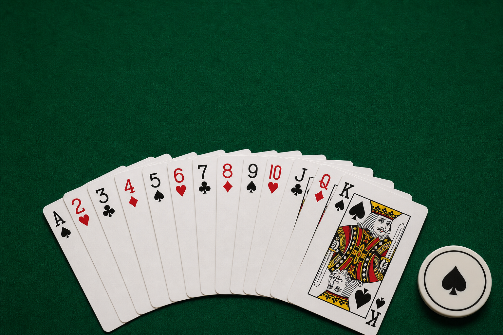

# Poker High Card

Poker High Card is a small Streamlit app that helps a poker table decide the first dealer or button position. Each player draws one card, and the strongest card wins.

Live app: https://poker-high-card.streamlit.app/



## Features

- Choose 2 to 10 players.
- Enter custom player names.
- Build a standard 52-card deck.
- Draw one unique card per player.
- Choose a play style directly from the title screen.
- Remember your nickname in the browser and prefill your player name.
- Choose Private device mode so each person can join from their own browser and see only their own card.
- Choose Table mode to show cards only and let everyone judge together.
- Choose Auto judge mode to show the winner and ranking automatically.
- Hear original music for the title screen, gameplay, and result reveal.
- Keep music off by default and let visitors turn it on at any time.
- Compare cards by poker high-card rules.
- Break rank ties by suit.
- Show every player's card with a consistent illustrated English-pattern deck.
- Highlight the winner.
- Celebrate your first-place draw with a large message, balloons, and result fanfare.
- Show a ranked results table with comparison details.
- Warn when multiple players have the same name.
- Reset the draw and start again.

## Card Strength

Ranks are compared in this order:

`A > K > Q > J > 10 > 9 > 8 > 7 > 6 > 5 > 4 > 3 > 2`

If two players draw the same rank, suits are compared in this order:

`Spades > Hearts > Diamonds > Clubs`

## Tech Stack

- Python
- Streamlit
- Browser Local Storage

## Card Artwork

The card faces in `assets/cards` come from the
[Webisso open-source playing cards](https://github.com/webisso/playing-cards)
project and are used under the MIT License. A copy of the license is included
at `assets/cards/LICENSE.webisso`.

## How to Run

Install the dependency:

```bash
pip install -r requirements.txt
```

Start the app:

```bash
streamlit run app.py
```

Then open the local URL shown in your terminal.

For Private device mode, have each player open the app from their own device or browser session. The host creates a table, then shares the six-character code or the page URL. The shared URL contains only the table code, so every player still joins with their own name and receives a separate private identity. Players can press Refresh table while waiting. When the table is full, the host presses Deal cards to start.

Table updates use a file lock and an atomic file replacement so two players joining at nearly the same time do not overwrite each other.

Private table codes are temporary. If the app restarts or redeploys, create a new table and share the new code.

## LinkedIn

The sidebar includes a **Share on LinkedIn** button for the live app. A
ready-to-use Japanese post is available in `LINKEDIN_POST.md`. The title artwork
at `assets/poker-title.png` can be attached as the post image.

## GitHub

This project is ready to publish to GitHub. It includes:

- `.gitignore` to keep Python cache files, virtual environments, local secrets, and macOS metadata out of the repository.
- GitHub Actions workflow at `.github/workflows/python-check.yml`.

The workflow installs dependencies and checks that `app.py` has valid Python syntax whenever code is pushed or a pull request is opened.
